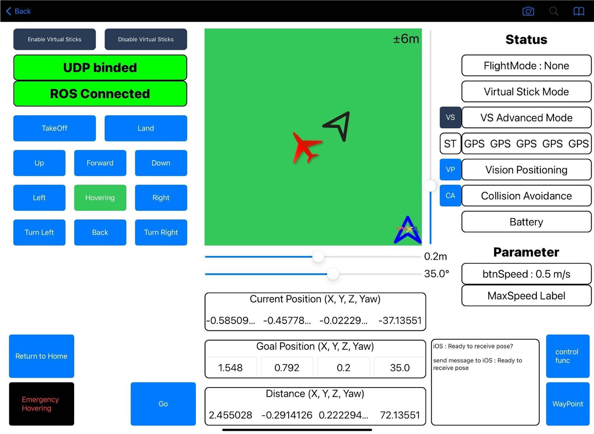

# First Scan Checklist

Use this page as a **pre-flight + first-success checklist**.
Follow the steps in order. If something is unsafe or unstable, **stop immediately** and fix it before continuing.

---

## Pre-flight (do not skip)

### Safety
- [ ] No people in the scan area
- [ ] Emergency landing / manual takeover tested
- [ ] Prop guards installed (recommended)
- [ ] Clear takeoff/landing zone prepared (2 m × 2 m recommended)

### Hardware
- [ ] Mount is rigid (no rattle)
- [ ] Phone is firmly secured (no sliding during braking/acceleration)
- [ ] Camera view is unobstructed
- [ ] Weight distribution is acceptable (hover test)

### Power
- [ ] Drone battery charged
- [ ] Phone battery charged (or external power secured)
- [ ] Tablet/controller battery charged

### Network
- [ ] All devices are on the same Wi-Fi SSID
- [ ] The server IP is reachable from the phone and tablet
- [ ] OS firewall allows the DART ports (temporarily disable for testing if needed)

### Marker
- [ ] QR marker placed flat, visible, and well lit
- [ ] No glare (avoid glossy paper / reflections)
- [ ] Marker detection/initialization succeeds in the phone app

{ style="display:block; margin: 12px auto 0 auto; width: 100%; max-width: 320px; background: #fff; padding: 10px; border-radius: 10px;" }

---

## Launch sequence

> The goal is to validate the pipeline **one step at a time**.  
> Do not move to the next step until **Expected** is true.

### 1) Start the server + viewer
**Action**
- Start the server
- Open the viewer page in your browser

**Expected**
- Viewer loads without console errors
- Server logs show a “ready / listening” state

---

### 2) Start the phone stream
**Action**
- Launch the phone app
- Start streaming

**Expected**
- Server logs confirm the phone is connected
- Viewer begins updating (status and/or trajectory)

---

### 3) Connect the tablet controller
**Action**
- Launch the tablet controller UI and connect to the system

**Expected**
- The UI shows a connected/healthy status
- You can switch modes or confirm the system state

{ style="display:block; margin: 12px auto 0 auto; width: 100%; max-width: 720px; border-radius: 10px;" }

---

### 4) Take off and hover (stability check)
**Action**
- Take off
- Hover for 10–15 seconds

**Expected**
- Stable hover (no severe wobble)
- No mount flexing or phone movement
- Phone tracking remains stable (no repeated resets)

---

### 5) Start an autonomous scan session
**Action**
- Start an autonomous scan session from the controller UI

**Expected**
- Viewer trajectory continues to update as the drone moves
- Reconstruction/coverage (if shown) grows over time

---

### 6) Monitor the scan and intervene if needed
**Action**
- Monitor the viewer and controller UI continuously

**Stop immediately if**
- Tracking is lost / pose jumps significantly
- You see obvious drift
- The drone approaches obstacles or enters an unsafe state

---

### 7) End the mission and confirm a session was saved
**Action**
- End the scan mission

**Expected**
- You see a “session saved / archived” message or log
- A new session folder/bundle is created on the server

---

### 8) Replay the session in the viewer
**Action**
- Load the saved session in the viewer and replay

**Expected**
- Trajectory playback works
- Data and video appear synchronized (if available)

---

## First success criteria

- [ ] The viewer shows **live updates** during flight
- [ ] A **session artifact** is saved when the mission ends
- [ ] The session **replays** correctly in the viewer

---

## Quick triage (when something fails)

### Viewer loads, but no data appears
- Confirm all devices are on the same SSID
- Confirm the server IP/port in phone/tablet settings
- Temporarily disable OS firewall to test

### Marker initialization fails
- Improve lighting and remove glare
- Reprint the marker larger (keep 100% scale; do not “fit to page”)
- Hold the camera closer and more perpendicular during initialization

### Autonomous scan becomes unstable
- Re-check payload weight distribution
- Increase mount rigidity (remove play/vibration)
- Start in a simpler space (fewer obstacles) for your first run

---

## Next steps

- Continue to: [Quickstart (Full System)](quickstart.md)
- Learn operations: [Running a Scan](../operation/run-scan.md) · [Monitoring & Replay](../operation/replay.md)
- If needed: [Troubleshooting](../troubleshooting/index.md)